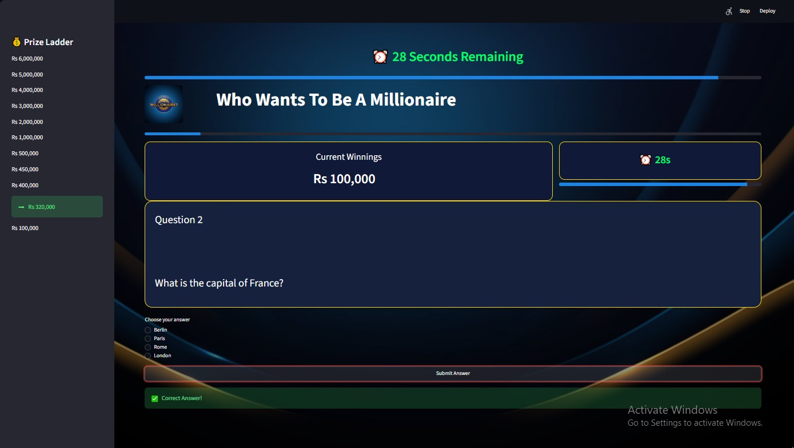

# 🎮 Who Wants To Be A Millionaire

<p align="center">
  
</p>

<p align="center">
  <strong>A modern recreation of the classic <em>Who Wants To Be A Millionaire</em> game built with Python and Streamlit.</strong>
</p>

<p align="center">


</p>

---

## 🌐 Live Demo

🚀 **Play the game online**

**https://mdaw82kcuf7xf2xbtsmzk9.streamlit.app**

---

## 📸 Preview

<p align="center">
  
</p>

---

## ✨ Features

* 🎯 Classic *Who Wants To Be A Millionaire* gameplay
* 💰 Interactive prize ladder
* 📈 Live winnings tracker
* 📊 Question progress indicator
* ⏱️ 30-second countdown timer for every question
* 🟢🟠🔴 Dynamic timer color changes (Green → Orange → Red)
* 📉 Shrinking timer progress bar
* ⏰ Automatic **Time's Up** detection
* ✅ Instant answer validation
* ❌ Game Over screen
* 🏆 Winner celebration with balloons
* 🔄 Play Again functionality
* 🖼️ Custom logo
* 🌌 Full-screen background image
* 🎨 Modern UI using HTML & CSS
* ⚡ Built entirely with Streamlit

---

## 🛠️ Technologies Used

* Python
* Streamlit
* Pillow (PIL)
* HTML & CSS (within Streamlit)

---

## 📂 Project Structure

```text
Millionaire-Game/
│
├── assets/
│   ├── logo.png
│   ├── background.jpeg
│   └── preview.png
│
├── app.py
├── questions.py
├── requirements.txt
├── README.md
└── LICENSE
```

---

## 🚀 Installation

### Clone the repository

```bash
git clone https://github.com/A6dur/Millionaire-Game.git
```

### Navigate to the project folder

```bash
cd Millionaire-Game
```

### Install dependencies

```bash
pip install -r requirements.txt
```

### Run the application

```bash
streamlit run app.py
```

---

## 🎮 How to Play

1. Launch the application.
2. Read the question carefully.
3. Select the correct answer.
4. Click **Submit Answer**.
5. Answer before the timer reaches zero.
6. Each correct answer increases your winnings.
7. A wrong answer—or running out of time—ends the game.
8. Reach the final question to become the Millionaire!

---

## 📦 Requirements

```text
streamlit
Pillow
```

Install them using:

```bash
pip install -r requirements.txt
```

---

## 🚀 Future Improvements

* 💡 50:50 Lifeline
* 👥 Ask the Audience
* ☎️ Phone a Friend
* 🔊 Sound effects
* 🎵 Background music
* 🏅 High score leaderboard
* 💾 Save game progress
* 🎬 Enhanced animations
* 📱 Improved mobile responsiveness

---

## 🤝 Contributing

Contributions are welcome!

1. Fork the repository.
2. Create a feature branch.
3. Commit your changes.
4. Push your branch.
5. Open a Pull Request.

---

## ⭐ Support

If you enjoyed this project, please consider giving it a **⭐ Star** on GitHub.

---

## 👨‍💻 Author

**Abdur Rafay**

GitHub: https://github.com/A6dur

---

<p align="center">
Made with ❤️ using Python & Streamlit
</p>
